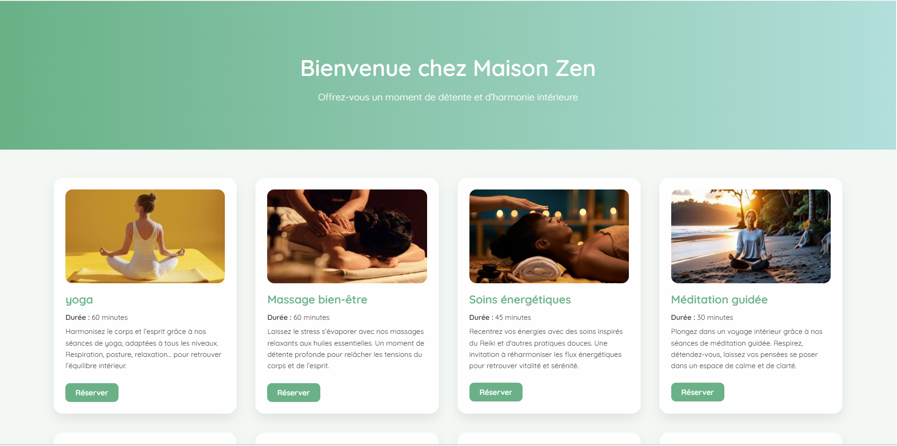
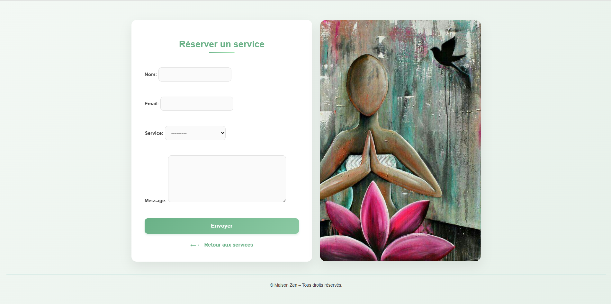
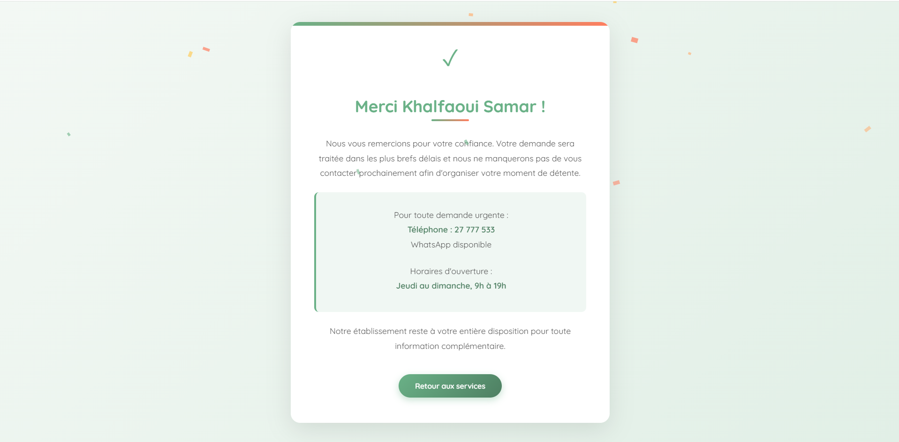

# 🌿 Maison Zen

[](https://www.python.org/) 
[](https://www.djangoproject.com/) 
[](LICENSE)


**Maison Zen** est un site vitrine développé avec **Django** pour présenter les services d’un centre de bien-être.  
Il permet aux utilisateurs de découvrir les services et de **réserver facilement** leur séance via un formulaire simple.

---

## ✨ Fonctionnalités

- 🧘‍♀️ Liste de services : Yoga, Massage, Hammam, Ateliers bien-être, etc.  
- ⏱ Description et durée de chaque service.  
- 📌 Bouton **Réserver** pour chaque service.  
- 📝 Formulaire simple : Nom, Prénom, Service, Message.  
- ✅ Message de confirmation avec :
  - Remerciements
  - Numéro de téléphone
  - Horaires d’ouverture  
- 🌐 Design responsive et intuitif.  
- ⚡ 100% fonctionnel **sans base de données**.

---

## 🖼️ Aperçu du site

### Page Services


### Formulaire de Réservation


### Message de Confirmation



---

## 💻 Technologies utilisées

- Python 3.x  
- Django 4.x  
- HTML / CSS  

---

## 🚀 Installation et lancement

1. Cloner le projet :

```bash
git clone https://github.com/ton-utilisateur/maison-zen.git
cd maison-zen
```

2. Créer un environnement virtuel et installer Django :

```bash
python -m venv venv
source venv/bin/activate  # Linux/Mac
venv\Scripts\activate     # Windows
pip install django
```

3. Lancer le serveur :

```bash
python manage.py runserver
```
Ouvrir le navigateur sur : http://127.0.0.1:8000/

---

📝 Remarques

Projet développé à des fins d’apprentissage et démonstration.
Toutes les réservations sont simulées, aucune base de données utilisée.

---

⭐ Contribution

- Ce projet est libre, tu peux le forker, le modifier ou l’utiliser pour apprendre.
- Si tu as des idées d’amélioration, ouvre une issue ou propose un pull request.

---

🎨 Astuces pour améliorer ton repo

- Ajouter de vraies captures d’écran de ton site dans le dossier images/ et les utiliser dans le README.
- Ajouter un GIF animé montrant le formulaire et la confirmation pour rendre le projet plus vivant.
- Ajouter un lien GitHub Pages ou déploiement Heroku si tu veux montrer ton site en ligne.